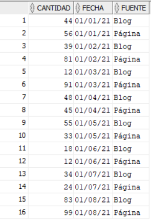
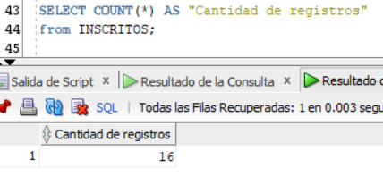
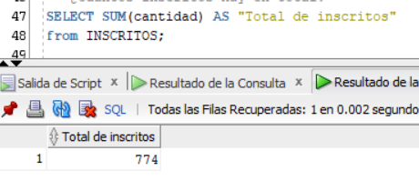
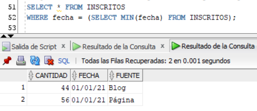
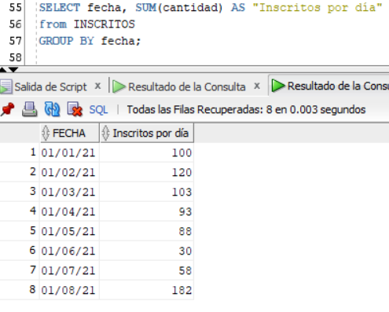
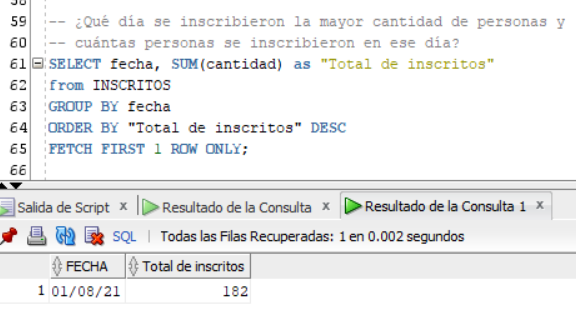

# Desafío - Manipulación de datos y transaccionalidad en las operaciones

## Tabla

## Desarrollo

1. ¿Cuántos registros hay?

2. ¿Cuántos inscritos hay en total?

3. ¿Cuál o cuáles son los registros de mayor antigüedad?

4. ¿Cuántos inscritos hay por día? (entendiendo un día como una fecha distinta de ahora en adelante)

5. ¿Qué día se inscribieron la mayor cantidad de personas y cuántas personas se inscribieron en ese día?

